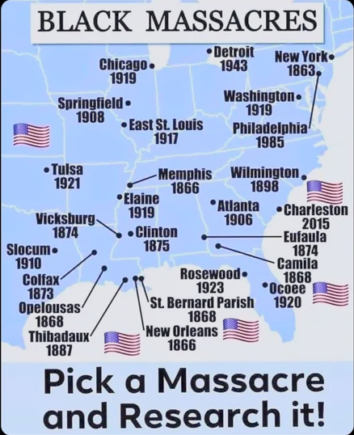
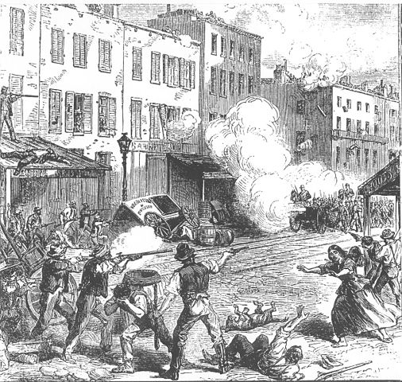
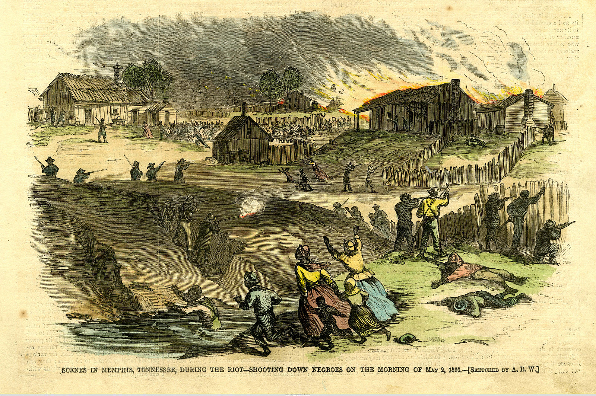
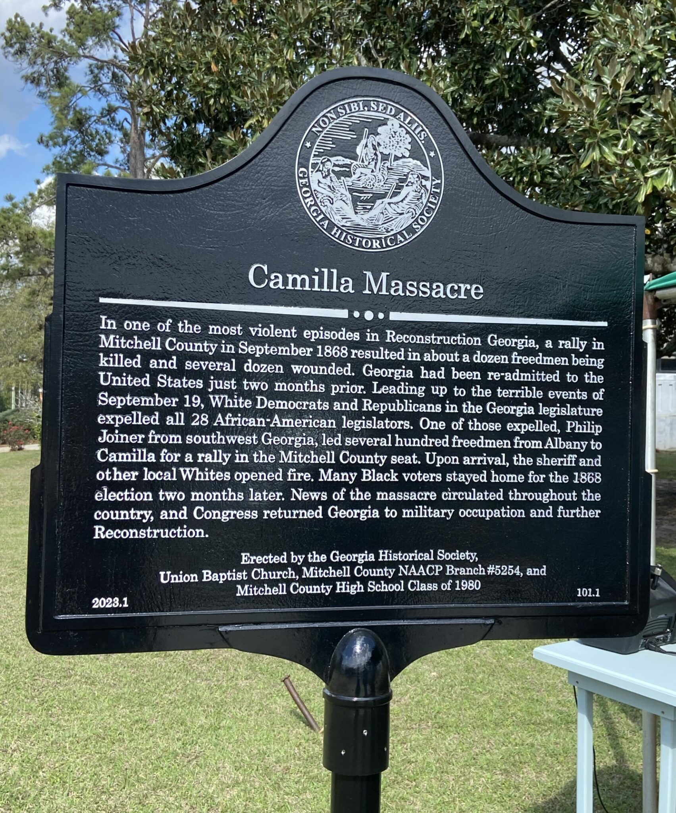
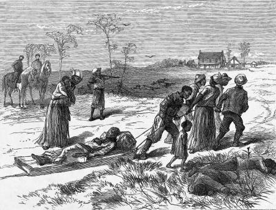

# Black Massacres in America

*Editor's personal note: If there's a general trend I've found in these instances, it is "racist white people successfully using violence to secure lasting political victories."*

New York, NY - 1863
------

* [Wikipedia - New York City draft riots](https://en.wikipedia.org/wiki/New_York_City_draft_riots)

> The New York City draft riots (July 13–16, 1863), sometimes referred to as the Manhattan draft riots and known at the time as Draft Week, were violent disturbances in Lower Manhattan, widely regarded as the culmination of working-class discontent with new laws passed by Congress that year to draft men to fight in the ongoing American Civil War. According to Toby Joyce, the riot represented a "civil war" within the city's Irish community, in that "mostly Irish American rioters confronted police, [while] soldiers, and pro-war politicians ... were also to a considerable extent from the local Irish immigrant community." The protests turned into a race riot against African-Americans by Irish rioters. The official death toll was listed at either 119 or 120 individuals.

Memphis, TN - 1866
------

* [Wikipedia - Memphis massacre of 1866](https://en.wikipedia.org/wiki/Memphis_massacre_of_1866)

> The Memphis massacre of 1866 was a rebellion with a series of violent events that occurred from May 1 to 3, 1866, in Memphis, Tennessee. The racial violence was ignited by political and social racism following the American Civil War, in the early stages of Reconstruction. After a shooting altercation between white policemen and black veterans recently mustered out of the Union Army, mobs of white residents and policemen rampaged through black neighborhoods and the houses of freedmen, attacking and killing black soldiers and civilians and committing many acts of robbery and arson. 

New Orleans, LA - 1866
------

* [Wikipedia - New Orleans massacre of 1866](https://en.wikipedia.org/wiki/New_Orleans_massacre_of_1866)

> The New Orleans massacre of 1866 occurred on July 30, when a peaceful demonstration of mostly Black Freedmen was set upon by a mob of white rioters, many of whom had been soldiers of the recently defeated Confederate States of America, leading to a full-scale massacre. According to the official report, a total of 38 were killed and 146 wounded, of whom 34 dead and 119 wounded were Black Freedmen. Unofficial estimates were higher.

Camilla, GA - 1868
------

* [Wikipedia - Camilla massacre](https://en.wikipedia.org/wiki/Camilla_massacre)

> The Camilla massacre took place in Camilla, Georgia, on Saturday, September 19, 1868. African Americans had been given the right to vote in Georgia's 1868 state constitution, which had passed in April, and in the months that followed, whites across the state used violence to combat their newfound political strength, often through the newly founded Ku Klux Klan. Georgia agents of the Freedmen’s Bureau recorded 336 cases of murder or assault with intent to kill against freedmen from January 1 through November 15.

St. Bernard Parish, LA - 1868
------

* [Wikipedia - St. Bernard Parish massacre](https://en.wikipedia.org/wiki/St._Bernard_Parish_massacre)

> In 1868, St. Bernard Parish was home to one of the deadliest massacres in Louisiana history. The St. Bernard Parish massacre occurred during the Reconstruction era, days before the Presidential election of 1868. As black men gained the right to vote, white Democrats of the parish feared losing their majority. Armed groups mobilized to violently silence these recently emancipated voters to win the election in favor of Democrat Horatio Seymour over Republican Ulysses S. Grant. The use of violence to suppress Republican votes was successful. Grant only received one vote from St. Bernard Parish, despite having a Republican majority. The reported number of freedmen killed varies from 35 to 135; the number of whites killed was two (one was killed in an attempt to help the victims).

Opelousas, LA - 1868
------

* [Wikipedia - Opelousas massacre](https://en.wikipedia.org/wiki/Opelousas_massacre)

> On September 28, white schoolteacher and Republican newspaper editor Emerson Bentley was attacked and beaten by three, Democratic white supremacists while teaching a classroom of Black children in Opelousas, Louisiana. Rumors of Bentley's death, while unfounded, led both Black Republicans and white supremacist Democrats, including the St. Landry Parish chapter of the Knights of the White Camelia, to threaten violent retribution. In the days following Bentley's subsequent covert flight to New Orleans, the massacre began. Heavily outnumbered, Black citizens were chased, captured, shot, murdered, and lynched during the following weeks. While estimates of casualties vary widely, several sources number the deaths between 150 and 300 black people and several dozen whites. Following the massacre, the Republican Party in St. Landry Parish was eliminated for several years.

Colfax, LA - 1873
------

* [Wikipedia - Colfax massacre](https://en.wikipedia.org/wiki/Colfax_massacre)

> The Colfax massacre, sometimes referred to as the Colfax riot, occurred on Easter Sunday, April 13, 1873, in Colfax, Louisiana, the parish seat of Grant Parish. An estimated 62–153 Black men were murdered while surrendering to a mob of former Confederate soldiers and members of the Ku Klux Klan. Three White men also died during the confrontation. After the contested 1872 election for governor of Louisiana and local offices, a group of White men armed with rifles and a small cannon overpowered Black freedmen and state militia occupying the Grant Parish courthouse in Colfax. Most of the freedmen were killed after surrendering, and nearly another 50 were killed later that night after being held as prisoners for several hours.

Eufaula, AL - 1874
------

* [Wikipedia - Election Massacre of 1874](https://en.wikipedia.org/wiki/Election_Massacre_of_1874)

> The Election Massacre of 1874, or Coup of 1874, took place on election day, November 3, 1874, near Eufaula, Alabama in Barbour County. Freedmen comprised a majority of the population and had been electing Republican candidates to office. Members of an Alabama chapter of the White League, a paramilitary group supporting the Democratic Party's drive to regain political power in the county and state, used firearms to ambush black Republicans at the polls. In Eufaula, members of the White League killed an estimated 15-40 black voters and wounded 70, while driving away more than 1,000 unarmed black people at the polls. In attacking the polling place in Spring Hill, the League effectively hijacked the elections. They turned all Republicans out of office and Democratic candidates took a majority of offices up for election. 

Clinton, MS - 1875
------

* [Wikipedia - Clinton riot of 1875](https://en.wikipedia.org/wiki/Clinton,_Mississippi#Clinton_Riot)

> In September 1875 during the election campaign, a Republican political rally was held in downtown Clinton, where 3,000 people were gathered expecting Governor Adelbert Ames and other prominent speakers. White insurgents disrupted the rally, attacking blacks in what was called the "Clinton Riot." It resulted in the deaths of several white men and an estimated 50 blacks later that night and over the next few days. More armed whites arrived by train and attacked blacks. Whites had been attacking black and white Republicans in every election cycle, and that year the paramilitary Red Shirts arose in the state as a force to intimidate blacks and suppress black voting. The governor appealed to the federal government for protection and the U.S. government sent more troops. But election-related violence continued through the fall and, together with fraud at the polls, resulted in white Democrats regaining control of the state legislature and, in 1876, the governor's seat. This political shift signaled the end of the Reconstruction era, confirmed when the federal government withdrew remaining troops in 1877. 

Thibodaux, LA - 1887
------

* [Wikipedia - Thibodaux massacre](https://en.wikipedia.org/wiki/Thibodaux_massacre)

> The Thibodaux Massacre was an episode of white supremacist violence that occurred in Thibodaux, Louisiana on November 23, 1887. It followed a three-week strike during the critical harvest season in which an estimated 10,000 workers protested against the living and working conditions which existed on sugar cane plantations in four parishes: Lafourche, Terrebonne, St. Mary, and Assumption. Tensions erupted into violence on November 21, 1887 when an unknown white man entered a black-owned barroom and killed one black laborer and wounded another.[1] Violence continued on November 23, 1887, when five town guards were ambushed and two wounded and local white paramilitary forces responded by attacking black workers and their families. Although the total number of casualties is unknown, the consensus is that at least 35 black people were killed during the next three days (some historians estimate that 50 black people were killed) and the total tally of killed, wounded, and missing was rumored to number in the hundreds, which makes it one of the most violent labor disputes in U.S. history. Reportedly, the victims included elders, women and children. All of the people who were killed were African American.

Atlanta, GA - 1906
------

* [Wikipedia - 1906 Atlanta race massacre](https://en.wikipedia.org/wiki/Atlanta_race_riot)

> The 1906 Atlanta Race Massacre, also known as the 1906 Atlanta Race Riot, was an episode of mass racial violence against African Americans in the United States in September 1906. Violent attacks by armed mobs of white Americans against African Americans in Atlanta, Georgia, began after newspapers, on the evening of September 22, 1906, published several unsubstantiated and luridly detailed reports of the alleged rapes of 4 local women by black men. Unofficial reports ranged from 10–100 black Americans killed during the massacre. According to the Atlanta History Center, some black Americans were hanged from lampposts; others were shot, beaten or stabbed to death. They were pulled from street cars and attacked on the street; white mobs invaded black neighborhoods, destroying homes and businesses. 

Springfield, IL - 1908
------

* [Wikipedia - Springfield race riot of 1908](https://en.wikipedia.org/wiki/Springfield_race_riot_of_1908)

> The Springfield race riot of 1908 consisted of events of mass racial violence committed against African Americans by a mob of about 5,000 white Americans and European immigrants in Springfield, Illinois, between August 14 and 16, 1908. Two black men had been arrested as suspects in a rape, and attempted rape and murder. The alleged victims were two young white women and the father of one of them. When a mob seeking to lynch the men discovered the sheriff had transferred them out of the city, the whites furiously spread out to attack black neighborhoods, murdered black citizens on the streets, and destroyed black businesses and homes. The state militia was called out to quell the rioting.

Slocum, TX - 1910
------

* [Wikipedia - Slocum massacre](https://en.wikipedia.org/wiki/Slocum_massacre)

> The Slocum massacre was the killing of Black residents by whites on July 29–30, 1910, in Slocum, an unincorporated community in Anderson County near Palestine in East Texas. Only seven deaths were officially confirmed, but some 22 were reported by major newspapers. This is the official count, but it is estimated that as many as one hundred African Americans were killed. Historians have offered several explanations for the sparking of the riot and massacre by whites.

> At the time, rumors placed responsibility on the blacks, saying that whites had armed in response to accounts of blacks planning a race war. The whites from the mob did their best to destroy any local evidence against them. African Americans appealed to higher levels of government for a fair investigation, but little to nothing was done on their behalf. As a result, the African-American population in Slocum declined drastically, as many left in fear for their lives. 

Chicago, IL - 1919
------

* [Wikipedia - Chicago race riot of 1919](https://en.wikipedia.org/wiki/Chicago_race_riot_of_1919)

> The Chicago race riot of 1919 was a violent racial conflict between white Americans and black Americans that began on the South Side of Chicago, Illinois, on July 27 and ended on August 3, 1919. During the riot, 38 people died (23 black and 15 white). Over the week, injuries attributed to the episodic confrontations stood at 537, two-thirds black and one-third white; and between 1,000 and 2,000 residents, most of them black, lost their homes.

Elaine, AR - 1919
------

* [Wikipedia - Elaine massacre](https://en.wikipedia.org/wiki/Elaine_massacre)

> The Elaine massacre occurred on September 30 – October 2, 1919, at Hoop Spur in the vicinity of Elaine in rural Phillips County, Arkansas, where African Americans were organizing against peonage and abuses in tenant farming. As many as several hundred African Americans and five white men were killed. The white mobs were aided by federal troops (requested by Arkansas governor Charles Hillman Brough) and local terrorist organizations. Gov. Brough led a contingent of 583 US soldiers from Camp Pike, with a 12-gun machine-gun battalion.

> According to the Encyclopedia of Arkansas, "the Elaine Massacre was by far the deadliest racial confrontation in Arkansas history and possibly the bloodiest racial conflict in the history of the United States".

Washington, D.C. - 1919
------

* [Wikipedia - Washington race riot of 1919](https://en.wikipedia.org/wiki/Washington_race_riot_of_1919)

> The Washington race riot of 1919 was civil unrest in Washington, D.C. from July 19, 1919, to July 24, 1919. Starting July 19, white men, many in the armed forces, responded to the rumored arrest of a black man for the rape of a white woman with four days of mob violence against black individuals and businesses. They rioted, randomly beat black people on the street, and pulled others off streetcars for attacks. When police refused to intervene, the black population fought back. Meanwhile, the four white-owned local papers, including the Washington Post, fanned the violence with incendiary headlines and calling in at least one instance for mobilization of a "clean-up" operation.

Ocoee, FL - 1920
------

* [Wikipedia - Ocoee massacre](https://en.wikipedia.org/wiki/Ocoee_massacre)

> The Ocoee massacre was an act of mass racial violence in November 1920 that saw a white mob attack numerous African-American residents in the northern parts of Ocoee, Florida, a town located in Orange County near Orlando. Ocoee was the home to 255 African-American residents and 560 white residents according to the 1920 Census. The massacre took place on November 2, the day of the U.S. presidential election leaving a lasting political, but also community, impact; the 1930 census showed 1,180 whites, 11 Native Americans, and 2 African Americans (0.2%).

Tulsa, OK - 1921
------

* [Wikipedia - Tulsa race massacre](https://en.wikipedia.org/wiki/Tulsa_race_massacre)

> The Tulsa race massacre, also known as the Tulsa race riot or the Black Wall Street massacre, was a two-day-long white supremacist terrorist massacre that took place between May 31 and June 1, 1921, when mobs of white residents, some of whom had been appointed as deputies and armed by city government officials, attacked black residents and destroyed homes and businesses of the Greenwood District in Tulsa, Oklahoma. The attackers burned and destroyed more than 35 square blocks of the neighborhood—at the time, one of the wealthiest black communities in the United States, colloquially known as "Black Wall Street."

> More than 800 people were admitted to hospitals, and as many as 6,000 black residents of Tulsa were interned in large facilities, many of them for several days. The 2001 Tulsa Reparations Coalition examination of events identified 39 dead, 26 black and 13 white, based on contemporary autopsy reports, death certificates, and other records. The commission gave several estimates ranging from 75 to 300 dead.

Rosewood, FL - 1923
------

* [Wikipedia - Rosewood massacre](https://en.wikipedia.org/wiki/Rosewood_massacre)

> The Rosewood massacre was a racially motivated massacre of black people and the destruction of a black town that took place during the first week of January 1923 in rural Levy County, Florida, United States. At least six black people were killed, but eyewitness accounts suggested a higher death toll of 27 to 150.

> Before the massacre, the town of Rosewood had been a quiet, primarily black, self-sufficient whistle stop on the Seaboard Air Line Railway. Trouble began when white men from several nearby towns lynched a black Rosewood resident because of accusations that a white woman in nearby Sumner had been assaulted by a black drifter. A mob of several hundred whites combed the countryside hunting for black people and burned almost every structure in Rosewood. For several days, survivors from the town hid in nearby swamps until they were evacuated to larger towns by train and car. No arrests were made for what happened in Rosewood. The town was abandoned by its former black and white residents; none of them ever moved back and the town ceased to exist. 

Detroit, MI - 1943
------

* [Wikipedia - Detroit race riot of 1943](https://en.wikipedia.org/wiki/Detroit_race_riot_of_1943)

> The 1943 Detroit race riot took place in Detroit, Michigan, from the evening of June 20 through to the early morning of June 22. It occurred in a period of dramatic population increase and social tensions associated with the military buildup of U.S. participation in World War II, as Detroit's automotive industry was converted to the war effort.

> The rioting in Detroit began among youths at Belle Isle Park on June 20, 1943; the unrest spread to other areas of the city and was exacerbated by false rumors of racial attacks in both the black and white communities. It continued until June 22. It was suppressed after 6,000 federal troops were ordered into the city to restore peace. A total of 34 people were killed, 25 of them black and most at the hands of the white police force, while 433 were wounded (75 percent of them black), and property valued at $2 million (worth $30.4 million in 2020) was destroyed. Most of the riot took place in the black area of Paradise Valley, the poorest neighborhood of the city.

Philadelphia, PA - 1985
------

* [Wikipedia - MOVE bombing](https://en.wikipedia.org/wiki/MOVE_bombing)

> The 1985 MOVE bombing, locally known by its date, May 13, 1985, was the aerial bombing and destruction of residential homes in the Cobbs Creek neighborhood of Philadelphia, Pennsylvania, United States, by the Philadelphia Police Department during an armed standoff with MOVE, a black liberation organization. As Philadelphia police attempted to evict MOVE members from a house, they were shot at. Philadelphia police aviators then dropped two explosive devices from a helicopter onto the roof of the occupied house. For 90 minutes, the Philadelphia Police Department allowed the resulting fire to burn out of control, destroying 61 previously evacuated neighboring homes over two city blocks and leaving 250 people homeless. Six adults and five children were killed in the attack, with one adult and one child surviving who were occupants of the home. A lawsuit in federal court found that the city used excessive force and violated constitutional protections against unreasonable search and seizure.

Charleston, SC - 2015
------

* [Wikipedia - Charleston church shooting](https://en.wikipedia.org/wiki/Charleston_church_shooting)

> An anti-black mass shooting and hate crime occurred on June 17, 2015, in Charleston, South Carolina. Nine people were killed, and one was injured, during a Bible study at Emanuel African Methodist Episcopal Church, the oldest black church in the Southern United States. Among the fatalities was the senior pastor, state senator Clementa C. Pinckney. All ten victims were African Americans. At the time, it was the deadliest mass shooting at a place of worship in U.S. history.

